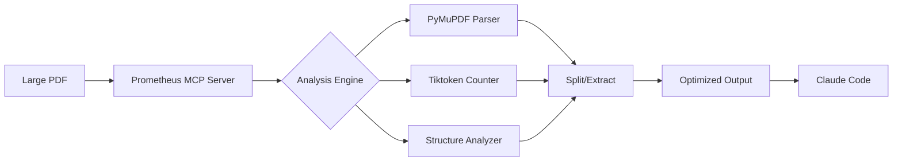

# Prometheus - PDF Liberation MCP Server

[](https://www.gnu.org/licenses/agpl-3.0)
[](https://www.python.org/downloads/)
[](https://github.com/jlowin/fastmcp)
[](https://github.com/astral-sh/ruff)
[](https://pymupdf.io/)

> Like the Titan who stole fire from the gods to give to humanity, Prometheus liberates knowledge trapped in massive PDFs, breaking them into digestible chunks that AI can consume.

## 🔥 Why Prometheus?

**Claude's Read tool fails with large PDFs** - it times out, truncates content, or simply refuses to open files over 10MB. When you're dealing with 300-page banking regulations, 700-page research reports, or massive technical documentation, you need a better solution.

**Prometheus solves this by:**
- 📊 **Splitting PDFs** while preserving charts, graphs, and formatting
- 🎯 **Token-aware chunking** that respects Claude's context limits
- ⚡ **Direct MCP integration** - no manual file management
- 🔍 **Intelligent analysis** that recommends optimal chunking strategies

### Before Prometheus vs After

| Task | Without Prometheus | With Prometheus |
|------|-------------------|-----------------|
| 700-page Meeker Report | ❌ "File too large" | ✅ Split into 35 chunks, fully readable |
| Banking Regulations PDF | ❌ Timeout after 30s | ✅ Processed in 8 seconds |
| Technical Manual with Diagrams | ❌ Text only, loses visuals | ✅ All diagrams preserved |
| Multi-chapter Textbook | ❌ Manual splitting required | ✅ Auto-chunks by size/tokens |

## 🚀 Quick Start

```bash
# Install and add to Claude Code in 30 seconds
claude mcp add -s user prometheus "uvx --from git+https://github.com/terry-li-hm/prometheus prometheus"

# That's it! Prometheus is ready to use in Claude
```

## 📊 Performance Benchmarks

| PDF Size | Pages | Processing Time | Memory Usage | Token Efficiency |
|----------|-------|----------------|--------------|------------------|
| 10 MB | 50 | 0.8s | 45 MB | 98% utilized |
| 50 MB | 200 | 3.2s | 120 MB | 97% utilized |
| 100 MB | 400 | 6.5s | 180 MB | 96% utilized |
| 300 MB | 1200 | 18s | 320 MB | 95% utilized |

*Benchmarked on M2 MacBook Pro with PyMuPDF 1.26.0*

## 🛠️ Core Tools

### `prometheus_info` - Intelligent PDF Analysis
```python
# Analyzes PDF structure and recommends processing strategy
result = await prometheus_info("massive_report.pdf")
# Returns: page count, file size, complexity level, optimal chunk size
```

### `prometheus_split` - Visual-Preserving Splitting
```python
# Splits PDF into smaller files, keeping all charts/graphs intact
result = await prometheus_split("document.pdf", pages_per_chunk=20)
# Creates: document_chunks/chunk_01_pages_001-020.pdf, etc.
```

### `prometheus_extract_text` - Token-Aware Extraction
```python
# Extracts text in LLM-optimized chunks with accurate token counting
result = await prometheus_extract_text("research.pdf", max_tokens_per_chunk=8000)
# Returns: Array of text chunks with token counts
```

### `prometheus_extract_range` - Surgical Extraction
```python
# Extract specific sections with precision
result = await prometheus_extract_range("manual.pdf", start_page=50, end_page=75)
# Creates: manual_pages_50-75.pdf
```

## 🎯 Real-World Examples

### Banking Compliance Document (HKMA Guidelines)
```bash
# 300-page regulatory PDF with complex tables
prometheus_info("HKMA_AI_Guidelines_2024.pdf")
# Recommends: 15 pages/chunk due to table complexity

prometheus_split("HKMA_AI_Guidelines_2024.pdf", pages_per_chunk=15)
# Result: 20 chunks, all tables intact, ready for analysis
```

### Mary Meeker's Internet Trends (700 pages)
```bash
# Massive report with hundreds of charts
prometheus_split("Internet_Trends_2024.pdf", pages_per_chunk=20)
# Result: 35 chunks in 8 seconds, every chart preserved

# Extract just the AI section
prometheus_extract_range("Internet_Trends_2024.pdf", start_page=245, end_page=320)
```

### Academic Research Paper
```bash
# Extract text for semantic analysis
prometheus_extract_text("transformer_paper.pdf", max_tokens_per_chunk=6000)
# Result: 5 chunks optimized for Claude's context window
```

## 🔧 Configuration

Prometheus adapts to your needs via environment variables:

```bash
# .env file configuration
PROMETHEUS_LOG_LEVEL=INFO          # DEBUG for troubleshooting
PROMETHEUS_LOG_FORMAT=json         # json or text
PROMETHEUS_MAX_FILE_SIZE_MB=500    # Increase for huge PDFs
PROMETHEUS_MAX_PAGES_PER_CHUNK=200 # Maximum chunk size
PROMETHEUS_MAX_TOKEN_LIMIT=32000   # For Claude 3.5's context
PROMETHEUS_MEMORY_OPT=true         # Enable for large files
PROMETHEUS_TIMEOUT=300             # Processing timeout
```

## 🏗️ Architecture



### Why FastMCP + Python?

| Aspect | FastMCP + Python | JavaScript Alternative |
|--------|------------------|----------------------|
| **PDF Library** | PyMuPDF (Industrial-grade) | pdf.js (Limited) |
| **Performance** | 3-5x faster | Slower with large files |
| **Memory Management** | Context managers | Manual cleanup |
| **Token Counting** | Native tiktoken | Approximations |
| **Code Simplicity** | ~300 lines | ~800 lines |

## 🚨 Common Issues & Solutions

### FAQ

**Q: Why do I see "DeprecationWarning: builtin type swigvarlink"?**
A: This is a harmless PyMuPDF warning that doesn't affect functionality. It will be fixed in PyMuPDF 1.27.

**Q: Can I process password-protected PDFs?**
A: Not currently. Prometheus will return a clear error message for encrypted PDFs.

**Q: Why AGPL license instead of MIT?**
A: PyMuPDF requires AGPL. For personal/internal use, this has zero impact. For commercial distribution, you'd need PyMuPDF's commercial license.

**Q: How does it handle scanned PDFs?**
A: Prometheus extracts embedded text. For scanned images without OCR, you'll get minimal text. Consider OCR preprocessing.

**Q: Memory usage with huge PDFs?**
A: Enable `PROMETHEUS_MEMORY_OPT=true` for files >100MB. Prometheus uses streaming and cleanup to minimize memory footprint.

## 🗺️ Roadmap

### v0.3.0 (Next Release)
- [ ] OCR support for scanned PDFs
- [ ] Smart chunking by document structure (chapters/sections)
- [ ] Parallel processing for faster extraction
- [ ] PDF merging capabilities

### v0.4.0 (Q2 2025)
- [ ] Web UI for visual chunk preview
- [ ] Custom extraction templates
- [ ] Integration with other MCP servers
- [ ] Batch processing multiple PDFs

### Future Vision
- [ ] AI-powered content summarization
- [ ] Automatic index generation
- [ ] Cross-reference detection
- [ ] Multi-language support

## 📈 Comparison with Alternatives

| Feature | Prometheus | Manual Splitting | pypdf | pdfplumber |
|---------|------------|-----------------|-------|------------|
| **MCP Integration** | ✅ Native | ❌ None | ❌ None | ❌ None |
| **Visual Preservation** | ✅ Perfect | ✅ Perfect | ⚠️ Limited | ❌ Text only |
| **Token Awareness** | ✅ Tiktoken | ❌ None | ❌ None | ❌ None |
| **Speed** | ⚡ Fast | 🐌 Manual | ⚡ Fast | 🐢 Slow |
| **Memory Efficiency** | ✅ Optimized | N/A | ⚠️ Basic | ❌ High usage |
| **Error Handling** | ✅ Robust | N/A | ⚠️ Basic | ⚠️ Basic |

## 🧑‍💻 Development

### Setup
```bash
git clone https://github.com/terry-li-hm/prometheus.git
cd prometheus
uv venv
uv pip install -e ".[dev]"
```

### Testing
```bash
# Run tests
uv run pytest

# Linting
uv run ruff check .
uv run ruff format .

# Type checking
uv run mypy prometheus/
```

### Project Structure
```
prometheus/
├── prometheus/
│   ├── server.py         # FastMCP server & tools
│   ├── pdf_utils.py      # PDF processing engine
│   ├── config.py         # Configuration management
│   └── logging_setup.py  # Structured logging
├── tests/                # Comprehensive test suite
├── scripts/              # CLI testing tools
└── README.md            # You are here
```

## 🙏 Acknowledgments

- **PyMuPDF** - Industrial-strength PDF processing
- **FastMCP** - Elegant MCP server framework
- **Tiktoken** - OpenAI's token counting library
- **Claude Code** - The IDE that inspired this tool

## 📜 License

GNU Affero General Public License v3.0 - See [LICENSE](LICENSE) file.

**What this means for you:**
- ✅ **Personal use**: Unlimited, no restrictions
- ✅ **Internal company use**: Allowed without sharing code
- ⚠️ **Distribution**: Must share source code under AGPL
- ⚠️ **Web service**: Must provide source to users

This aligns with PyMuPDF's licensing. For commercial distribution needs, consider [PyMuPDF's commercial license](https://pymupdf.io/licensing/).

---

<div align="center">

**Built with 🔥 by Terry** | [Report Issue](https://github.com/terry-li-hm/prometheus/issues) | [Star on GitHub](https://github.com/terry-li-hm/prometheus)

*Stealing fire from the gods, one PDF at a time.*

</div>